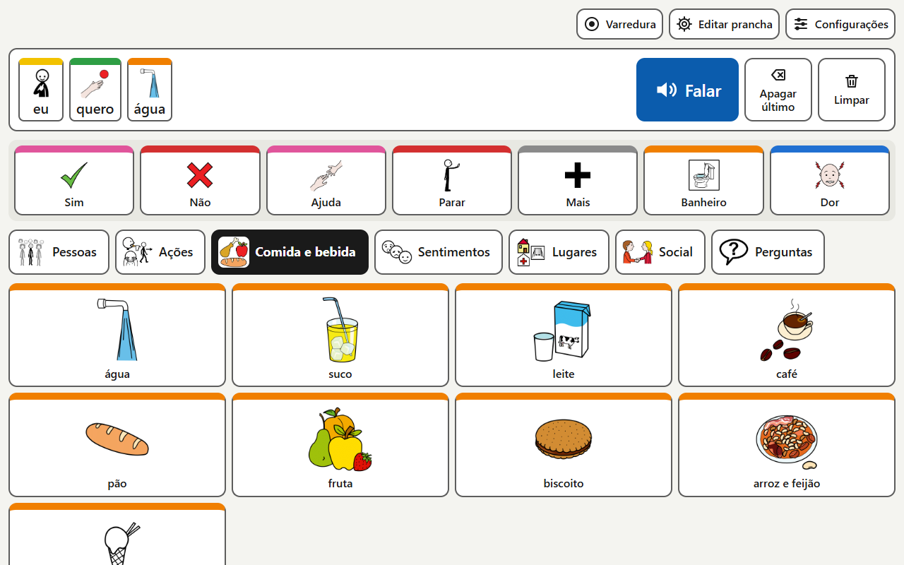
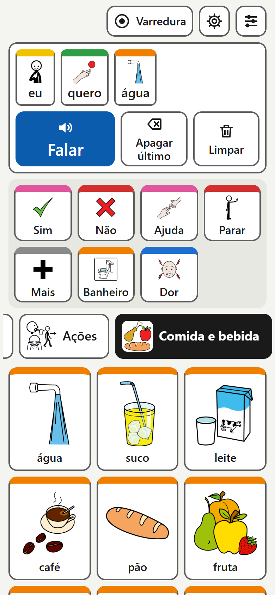
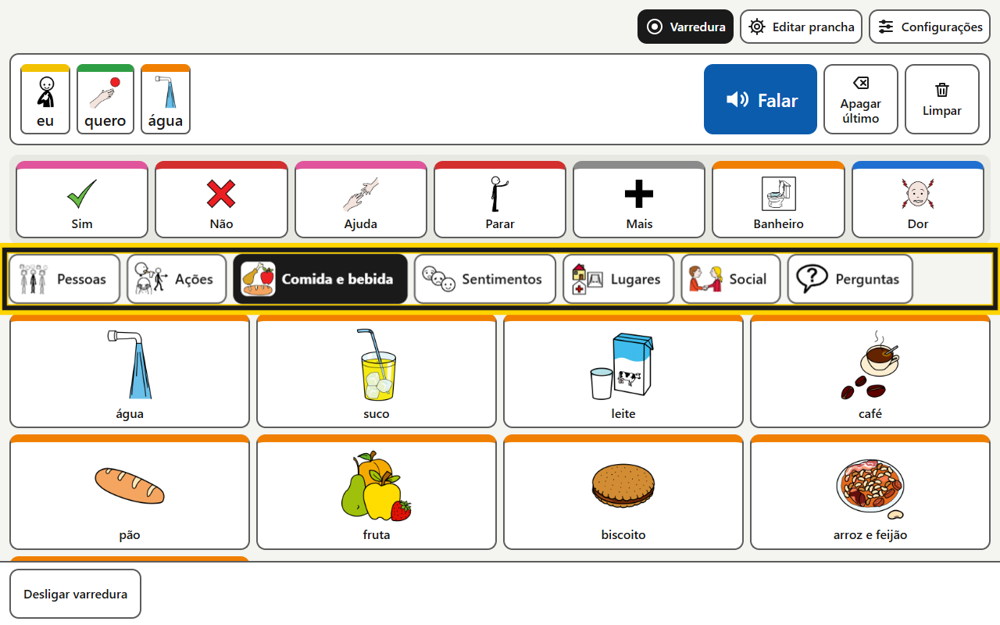
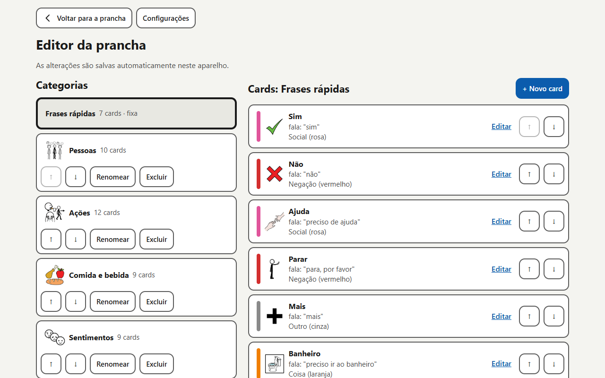
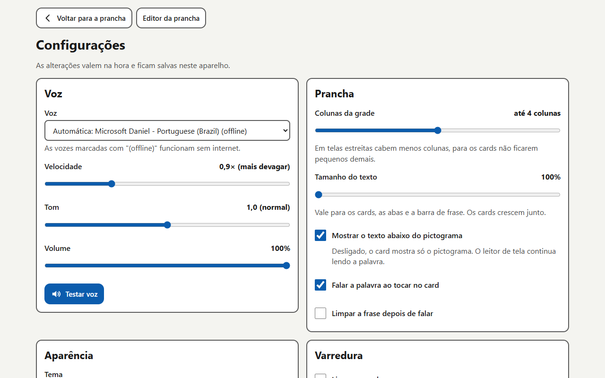
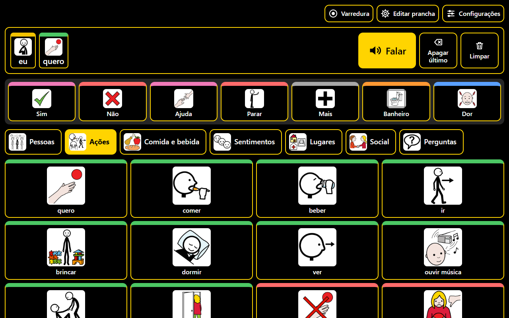
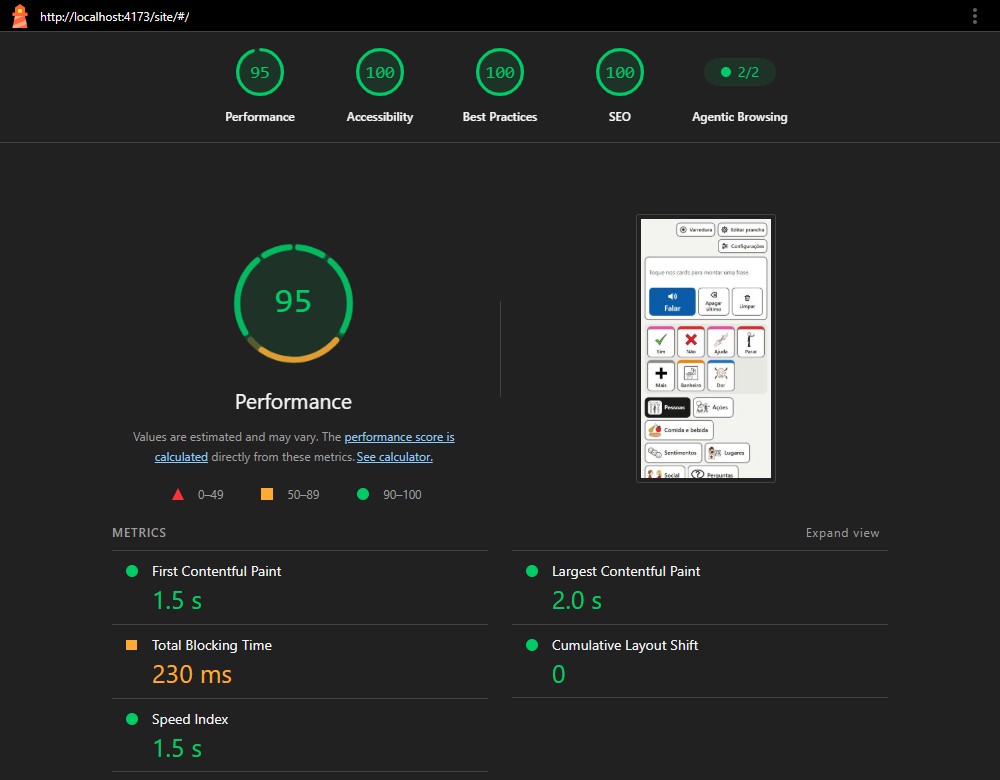

# Comunicador Alternativo (CAA)

Comunicador por pictogramas **gratuito**, que roda no navegador de qualquer celular, tablet ou computador, **funciona sem internet**, fala as frases em voz alta e tem **modo de varredura** para quem usa um único botão (acionador).

- **App publicado:** https://seguranca-digital.github.io/site/

Trabalho da disciplina de **Tecnologias Assistivas**: um MVP digital de baixo custo, construído com co-design, para uma demanda funcional real.



---

## Problema e público-alvo

Pessoas com comunicação oral limitada ou ausente (por exemplo: autismo não verbal, afasia após AVC, paralisia cerebral, ELA) dependem de **Comunicação Aumentativa e Alternativa (CAA)**. As pranchas de papel são limitadas e se desgastam; os apps comerciais costumam ser pagos ou exigir tablets dedicados.

O app atende dois públicos:

- **Usuário principal:** a pessoa que se comunica usando a prancha.
- **Parceiro de comunicação:** cuidador, familiar, professor(a) ou terapeuta, que configura as pranchas.

## Processo de co-design

O MVP é o ponto de partida das sessões de co-design com usuários e parceiros de comunicação. Por isso, todo o vocabulário (cards, categorias e frases rápidas) fica em JSON ([`src/data/vocabulario-inicial.json`](src/data/vocabulario-inicial.json)), e o parceiro pode ajustar a prancha pelo próprio app, sem mexer no código.

Cada sessão é registrada em [`docs/co-design.md`](docs/co-design.md), com os participantes identificados só por papel ou código, as tarefas propostas, as dificuldades observadas e as mudanças que resultaram delas.

## Funcionalidades

### Prancha com voz

- **Barra de frase:** os cards escolhidos aparecem em sequência. O botão **Falar** é o maior da tela; também há **Apagar último** e **Limpar**.
- **Frases rápidas** sempre visíveis: Sim, Não, Ajuda, Parar, Mais, Banheiro, Dor.
- **Categorias** com pictogramas: Pessoas, Ações, Comida e bebida, Sentimentos, Lugares, Social, Perguntas.
- Cada card tem um texto exibido e um texto falado. Por exemplo, "Banheiro" fala "preciso ir ao banheiro".
- A cor da borda indica a classe da palavra (Chave de Fitzgerald adaptada): pessoa em amarelo, ação em verde, coisa em laranja, descrição em azul, social em rosa, pergunta em roxo, negação em vermelho.
- A voz é escolhida automaticamente, dando preferência a uma **voz em português do Brasil instalada no aparelho**, que funciona offline.
- Se o navegador não tiver síntese de voz, o app avisa e oferece **Mostrar frase**, que exibe a frase em texto grande para o parceiro ler.
- **No celular em retrato,** a grade de cards aparece sem precisar rolar a tela: as categorias ficam em uma faixa com rolagem lateral, e a frase rola na horizontal em vez de quebrar linha. Assim, os cards não mudam de lugar enquanto a frase cresce.



### Modo de varredura (acessibilidade motora)



Para quem não consegue tocar na tela com precisão. O app destaca as opções uma de cada vez, e a pessoa aperta o acionador quando a opção desejada está destacada.

- Varredura em dois níveis: primeiro os grupos (ações da frase, frases rápidas, categorias, linhas da grade) e depois os itens do grupo escolhido.
- O acionador é a tecla **Espaço** ou **Enter**, ou um toque em **qualquer ponto da tela**.
- **Tempo de aceitação:** o toque só vale se durar um tempo mínimo, o que filtra toques acidentais e tremores.
- **Modo dois botões:** Espaço avança e Enter seleciona, sem timer.
- **Varredura auditiva:** fala baixo o nome do item destacado, para usuários com baixa visão.

### Editor de pranchas (parceiro de comunicação)



- Para abrir, é preciso **segurar o botão por 2 segundos**, para o usuário principal não entrar sem querer.
- Criar, renomear, excluir e reordenar categorias. Criar, editar, ocultar, excluir, mover e reordenar cards (com botões ↑ ↓, acessíveis por teclado).
- Imagem do card: **busca no ARASAAC** (a imagem escolhida fica salva e funciona offline), **foto** tirada ou enviada pelo celular (redimensionada no próprio aparelho) ou sem imagem.
- **Backup:** exportar e importar um arquivo `.json` com tudo, incluindo as imagens. É assim que a prancha passa de um aparelho para outro.
- Restaurar o vocabulário inicial. Tudo é salvo automaticamente no aparelho.

### Configurações



- **Voz:** escolha da voz (as que funcionam offline aparecem marcadas), velocidade, tom, volume e botão **Testar voz**.
- **Prancha:** número de colunas, tamanho do texto, mostrar ou ocultar rótulos, falar ao tocar e limpar a frase depois de falar.
- **Aparência:** tema claro, escuro ou alto contraste.
- **Varredura:** modo, intervalo, tempo de aceitação, varredura auditiva e voltas antes de pausar.



### Funciona offline (PWA)

Depois do primeiro acesso, o app pode ser instalado ("Adicionar à tela inicial") e funciona **sem internet**, incluindo todos os pictogramas do vocabulário inicial.

## Acessibilidade

Meta: **WCAG 2.2 nível AA**. A acessibilidade foi aplicada desde o primeiro componente:

- Cards, abas e ações são sempre `<button>` de verdade. Os pictogramas usam `alt=""`, para o leitor de tela não ler a palavra duas vezes.
- Área de toque de pelo menos **64×64 px** nos cards, com espaçamento mínimo de 8 px.
- Navegação completa por teclado, com **setas dentro da grade e das abas** (roving tabindex) e foco sempre visível.
- Contraste de texto de pelo menos 4,5:1 nos três temas. A cor da classe gramatical é complementar: a informação nunca depende só da cor.
- Sem fala duplicada: com "falar ao tocar" desligado, a palavra adicionada é anunciada ao leitor de tela via `role="status"`.
- Respeita `prefers-reduced-motion` e nada pisca.
- Ações destrutivas (excluir, importar, restaurar) pedem confirmação em um `<dialog>` nativo, com o foco gerenciado.
- Unidades `rem`: o layout aguenta zoom de 200%.

### Resultado do Lighthouse

Lighthouse 13.5, emulação de celular, build de produção, em 30/09/2026:

| Tela | Acessibilidade | Desempenho | Boas práticas | SEO |
| :--- | :---: | :---: | :---: | :---: |
| Prancha | **100** | 98 | 100 | 100 |
| Editor | **100** | – | – | – |
| Configurações | **100** | – | – | – |
| Sobre | **100** | – | – | – |



O Lighthouse deixou de avaliar PWA na versão 12. A instalabilidade foi confirmada pela verificação do próprio Chrome, a mesma de DevTools → Application → Manifest, que não apontou erros. O funcionamento offline também foi confirmado: com a rede desligada, o app abre, os pictogramas carregam e dá para montar uma frase. Falar offline depende de haver uma voz instalada no aparelho.

**Pendente:** testes com leitor de tela (**NVDA** no Windows e **TalkBack** no Android).

## Tecnologias e custo zero

| Item | Escolha |
| :--- | :--- |
| Interface | Vue 3 + TypeScript, Vite |
| Estado e rotas | Pinia, Vue Router |
| Dados no aparelho | IndexedDB (`idb-keyval`), que guarda pranchas e imagens |
| Offline e instalação | `vite-plugin-pwa` (service worker + manifest) |
| Voz | Web Speech API, nativa do navegador |
| Pictogramas | ARASAAC, baixados e publicados junto com o app |
| Testes | Vitest + @vue/test-utils |
| Hospedagem | GitHub Pages, com deploy pelo GitHub Actions |

**Por que o custo é zero:**

- **Sem servidor:** o app é um site estático. As pranchas ficam no próprio aparelho, e o backup em arquivo substitui a sincronização.
- **Hospedagem gratuita** no GitHub Pages.
- **APIs nativas:** a voz é a do próprio aparelho, sem serviço pago de síntese de voz.
- **Roda no que a pessoa já tem:** celular, tablet ou computador, sem aparelho dedicado.

## Como rodar localmente

Requer Node.js 20.19+ ou 22.12+.

```bash
npm install
npm run dev          # servidor de desenvolvimento
npm run test         # testes
npm run build        # gera o site estático em dist/
npm run preview      # serve o build (para testar o modo offline)
npm run pictogramas  # baixa os pictogramas do vocabulário inicial (ARASAAC)
```

Os pictogramas já estão no repositório (`public/pictogramas/`). O `npm run pictogramas` só é necessário depois de mudar o vocabulário inicial; ele não baixa de novo o que já existe.

## Deploy

O app é publicado no **GitHub Pages** pelo workflow [`.github/workflows/deploy.yml`](.github/workflows/deploy.yml) a cada push na `main`: ele roda os testes, gera o build e publica a pasta `dist/`.

Passo manual, feito uma única vez no repositório:

**Settings → Pages → Source: GitHub Actions**

O endereço fica `https://<usuário-ou-organização>.github.io/<nome-do-repositório>/`. O workflow passa o nome do repositório em `BASE_PATH`, por isso o app funciona com qualquer nome de repositório.

## Limitações conhecidas

- **As vozes variam por aparelho.** A qualidade e a disponibilidade de vozes em português dependem do sistema e do navegador.
- **Algumas vozes precisam de internet,** como as vozes online do Chrome no computador. Por isso o app prefere vozes instaladas no aparelho, que funcionam offline.
- **No iOS, a primeira fala precisa de um toque** na tela, por restrição do Safari.
- **A busca no ARASAAC exige internet.** A imagem escolhida fica salva e depois funciona offline.
- **As pranchas ficam só no aparelho.** Para levá-las a outro aparelho, use o backup (exportar e importar).

## Créditos e licenças

- **Código:** licença [MIT](LICENSE).
- **Pictogramas:**

  > Os símbolos pictográficos utilizados são propriedade do Governo de Aragão e foram criados por Sergio Palao para a ARASAAC (https://arasaac.org), que os distribui sob uma licença Creative Commons (BY-NC-SA).